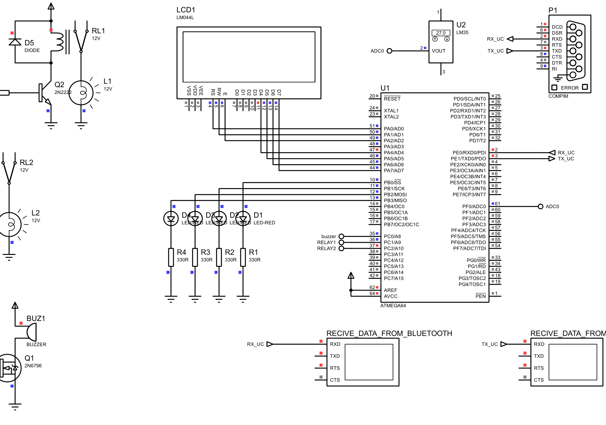

# TempraLink: Bluetooth-Controlled ATmega64 System



## 📌 Overview
**TempraLink** is a commercial-grade embedded system solution for remote monitoring and control. Based on the robust **ATmega64A** microcontroller, the system establishes a two-way Bluetooth communication link with an Android smartphone, allowing users to monitor environmental temperature and remotely control various actuators (LEDs, Relays, and a Buzzer).

## 🚀 Commercial Product Information

| Attribute | Description |
| :--- | :--- |
| **Product Name** | TempraLink |
| **Product Type** | Bluetooth Remote I/O & Temperature Monitor |
| **Target Market** | Industrial Automation, Smart Home, Educational Labs |
| **Key Differentiator** | Simultaneous control of multiple relays with real-time temperature feedback (C/F). |

### Key Selling Points
- **Remote Monitoring:** Check temperature from your phone without leaving your desk.
- **Industrial Reliability:** Uses MOSFET and transistor drivers for high-current relays and buzzers.
- **Simple Integration:** The universal command protocol (ASCII characters) makes it easy to integrate with existing Bluetooth apps.

---

## ✨ Key Features
- **Real-Time Temperature Monitoring:** Reads analog data from an LM35 sensor (converted via ADC) and displays it on a 20x4 LCD in both Celsius and Fahrenheit.
- **Remote Actuator Control:** Independently toggles 4 LEDs, 2 Industrial Relays, and an Active Buzzer via the "Arduino Bluetooth Control" Android app.
- **Simultaneous Control & Special Modes:** Includes a dedicated "Blink Mode" for all LEDs and simultaneous control mechanisms for multiple relays.
- **Live Telemetry:** Transmits system state and temperature data back to the Android terminal every 500 milliseconds.

## 🛠️ Hardware & Pin Mapping
The project is simulated in **Proteus** with the MCU clock set to `1.000000 MHz`.

| Component | ATmega64A Pin | Description |
| :--- | :--- | :--- |
| **LM35 Sensor** | `PF0 (ADC0)` | Analog input for temperature sensing. |
| **20x4 LCD** | `PORTA` | `PA0=RS`, `PA1=RW`, `PA2=E`, `PA4-PA7=D4-D7` (4-bit mode). |
| **LED 1 to 4** | `PB0 to PB3` | Outputs controlling Red LEDs (with 330Ω resistors). |
| **Buzzer** | `PC0` | Output driving an active buzzer via a 2N6796 MOSFET. |
| **Relay 1 & 2** | `PC1 & PC2` | Outputs driving 12V generic relays via 2N2222 transistors. |
| **Bluetooth (COMPIM)** | `PE0 (RXD0)` / `PE1 (TXD0)`| Serial UART communication at `9600 bps`. |

## 📡 Bluetooth Communication Protocol
The system expects single-byte ASCII characters over UART (`9600 8-N-1`) to trigger actions. The Android app **[Arduino Bluetooth Control](https://play.google.com/store/apps/details?id=com.giristudio.hc05.bluetooth.arduino.control)** must be configured as follows in the Settings menu:

| App Interface | Button / Action | ON Character | OFF Character | Microcontroller Response |
| :---: | :---: | :---: | :---: | :--- |
| **Switches** | Switch 1 | `A` | `a` | Turns LED 1 (PB0) ON / OFF |
| **Switches** | Switch 2 | `B` | `b` | Turns LED 2 (PB1) ON / OFF |
| **Switches** | Switch 3 | `C` | `c` | Turns LED 3 (PB2) ON / OFF |
| **Switches** | Switch 4 | `D` | `d` | Turns LED 4 (PB3) ON / OFF |
| **Switches** | Switch 5 | `E` | `e` | Turns Relay 1 (PC1) ON / OFF |
| **Switches** | Switch 6 | `F` | `f` | Turns Relay 2 (PC2) ON / OFF |
| **Switches** | Switch 7 | `G` | `g` | Turns Buzzer (PC0) ON / OFF |
| **Switches** | Switch 8 | `U` | `u` | Toggles Temperature unit (Celsius ↔ Fahrenheit) |
| **Switches** | Switch 9 | `K` | `k` | Toggles LED Blink Mode (all 4 LEDs flashing) |
| **LED/Lamp** | Lamp Page | `H` | `h` | Turns **both** Relays ON / OFF simultaneously |

## 🚀 How to Run the Simulation

### 1. Prerequisites
- **CodeVisionAVR:** To compile the C code (`.prj`, `.c`).
- **Proteus 8 Professional:** To run the hardware simulation (`.pdsprj`).
- **Virtual Serial Port Emulator:** (Optional but required for PC-to-Android simulation) to bridge Windows Bluetooth to COM ports.

### 2. Setup Instructions
1.  **Compile the Firmware:**
    - Open `src/code/project.prj` in CodeVisionAVR.
    - Build the project (`Shift + F9`) to generate the `.hex` file.
2.  **Configure Windows Bluetooth Port:**
    - Pair your Android phone with your Windows PC.
    - In Windows Device Manager, find your Bluetooth COM port and force its number to **COM30** (via *Properties > Port Settings > Advanced*).
3.  **Run Proteus:**
    - Open `src/Project-Simulation.pdsprj`.
    - Double-click the `COMPIM` module and ensure **Physical Port** is set to `COM30` and **Hardware Flow Control** is set to `None`.
    - Click the **Play** button at the bottom left.
4.  **Connect via Android:**
    - Open the "Arduino Bluetooth Control" app on your phone.
    - Connect to your PC's Bluetooth name.
    - Navigate to the **Switches** page and start controlling the circuit!

## 📂 Repository Structure
```text
├── report-fa.docx               # Final project report word file (Persian)
├── report-fa.pdf                # Final project report (Persian)
├── TODO.md                      # Project development roadmap
├── src/
│   ├── Project-Simulation.pdsprj # Proteus simulation file
│   ├── Project-Simulation.svg    # High-res schematic export
│   └── code/                     # Firmware source code
│       ├── project.c             # Main C logic
│       └── project.prj           # CodeVisionAVR project file
```

---

*Developed for the Digital Laboratory Final Project. Coded in CodeVisionAVR, simulated in Proteus.*
```
